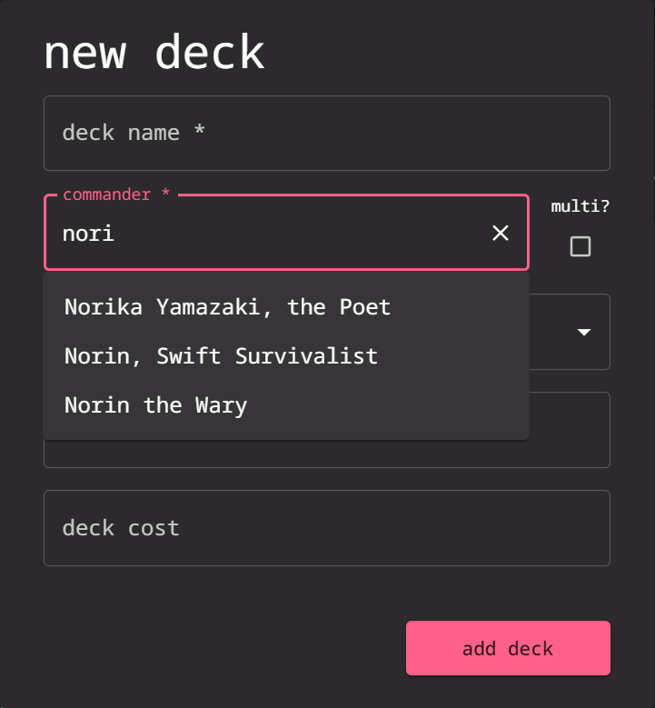
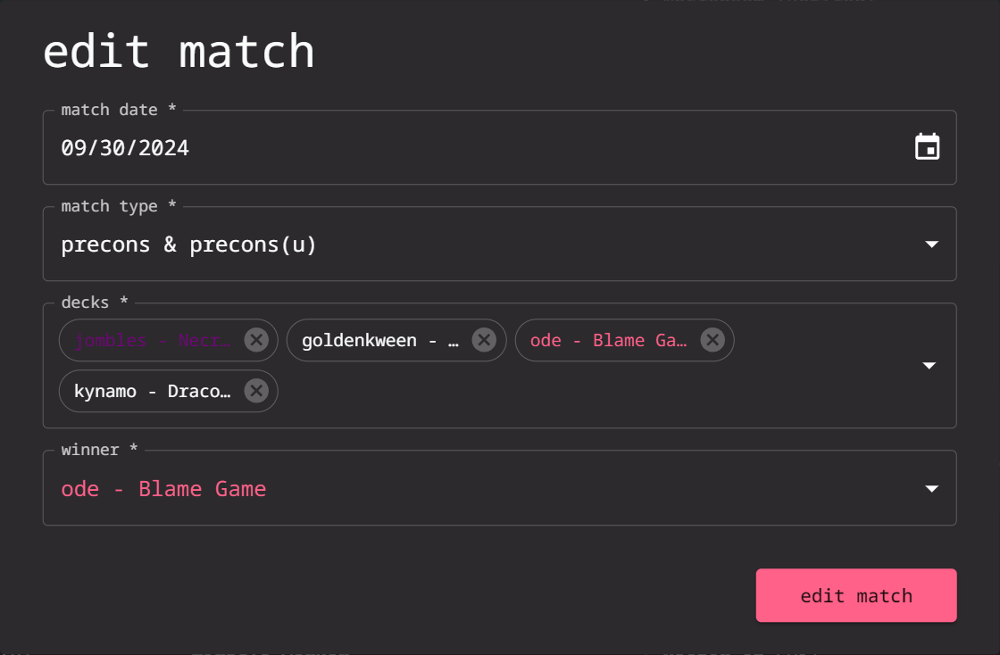
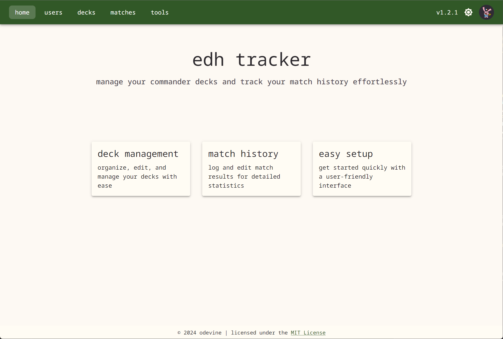

# EDH Tracker

EDH Tracker is a tool for managing Magic: The Gathering Commander decks and tracking matches. This project includes both a frontend and a backend. The frontend is built using Vite, React, and TypeScript, while the backend leverages AWS Amplify.

App is currently live at: [edh.devine.dev](https://edh.devine.dev)

## Table of Contents

- [Features](#features)
  - [Deck Management](#deck-management)
  - [Match Management](#match-management)
  - [User Statistics](#user-statistics)
  - [User Profiles](#user-profiles)
  - [Light and Dark Themes](#light-and-dark-themes)
- [Setup Instructions](#setup-instructions)
  - [Frontend Setup (Vite/React/Typescript)](#frontend-setup)
  - [Backend Setup (AWS Amplify)](#backend-setup-aws-amplify)

## Features

### Deck Management

- **Add Deck**: Create a new deck by providing details like name, format, etc.

  

  

- **Edit Deck**: Modify existing deck details.

- **Mark Inactive**: Mark decks as inactive to hide them from the decks table and when adding decks to matches.

  

- **Remove Deck**: Delete a deck from your collection (only available if the deck has not participated in a match).

  

- **View Other Decks**: View and filter other player's decks, as well as see generated statistics based on their match history.

  

  

  

### Match Management

- **Add Match**: Log a new match with players, decks, and results.

  

  

  

- **Edit Match**: Modify the details of an existing match (**DANGEROUS**: only available to admins).

  

- **Remove Match**: Delete a match from the history (**DANGEROUS**: only available to admins).

- **View Match History**: View and filter match history based on player, deck, and format.

  

### User Statistics

Customize your profile to reflect your play style, manage your decks, and track your game history. You can update personal information, set profile images, and configure preferences for a more personalized experience within the app.


### User Profiles

Customize your profile to reflect your play style, manage your decks, and track your game history. You can update personal information, set profile images, and configure preferences for a more personalized experience within the app.


### Light and Dark Themes

EDH Tracker supports both light and dark themes to enhance user experience. Users can toggle between these modes based on their preferences, ensuring optimal visibility and comfort. Highlight colors can be set in individual user profiles.




## Setup Instructions

### Frontend Setup

1. Clone the repository:

   ```bash
   git clone https://github.com/odevine/edh-tracker.git
   cd edh-tracker
   ```

2. Install dependencies:

   ```bash
   npm install
   ```

3. Start the development server:
   ```bash
   npm run dev
   ```
   This will start the Vite development server, providing hot module replacement for React and TypeScript.

### Backend Setup (AWS Amplify)

1. Install the Amplify CLI:

   ```bash
   npm install -g @aws-amplify/cli
   ```

2. Configure Amplify:

   ```bash
   amplify configure
   ```

   Follow the instructions to set up your AWS credentials.

3. Initialize Amplify in the project:

   ```bash
   amplify init
   ```

4. Deploy the backend:
   ```bash
   amplify push
   ```
   This will deploy the AWS resources needed (API, authentication, storage, etc.) for the backend.
